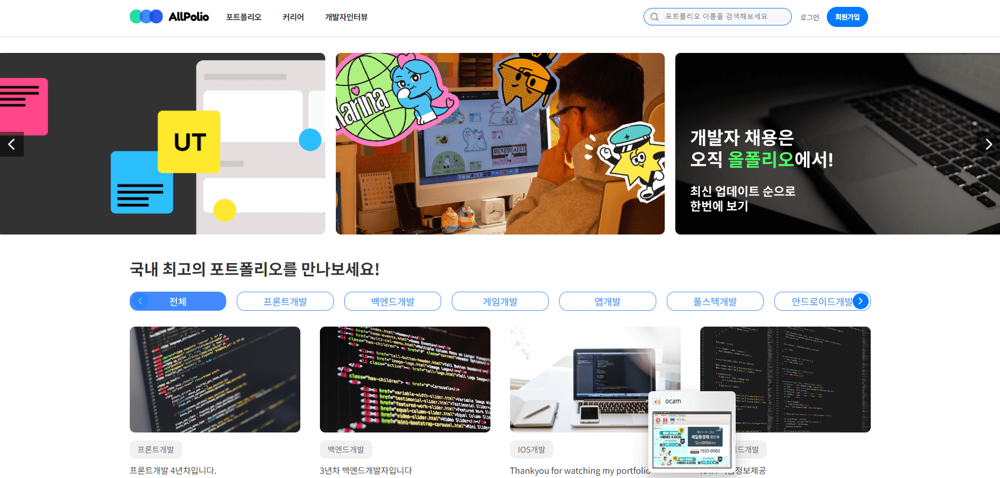
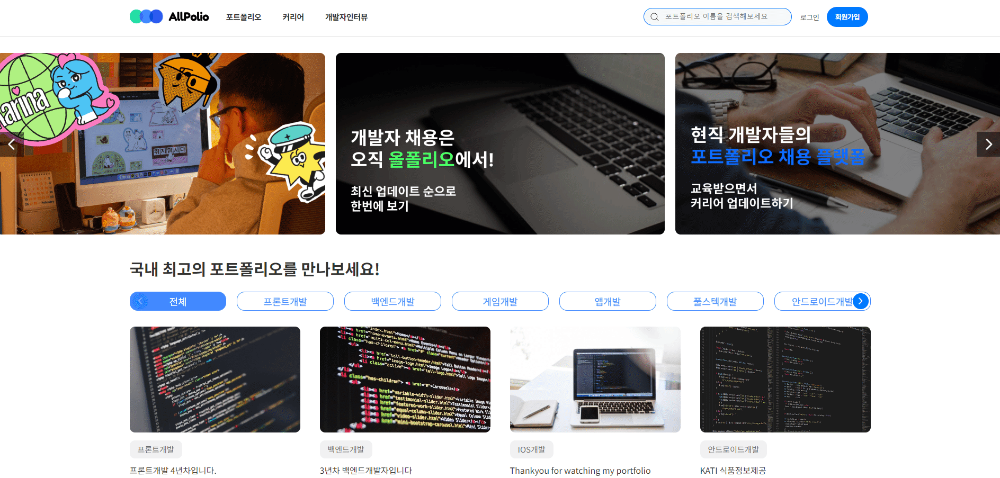

# AllPolio 홈페이지 제작

 
 

# 프로젝트 참고 또는 리뉴얼 사이트

1. <a href="https://www.wanted.co.kr/jobsfeed" target="_blank"> 원티드 </a>
2. <a href="https://notefolio.net/" target="_blank"> 노트폴리오 </a>

# 사용 기술  

- [X] React
- [X] Styled-Components
- [X] Axios 
- [X] Router 
- [X] Redux-toolkit

## 프로젝트 주요 기능
1. 카테고리 분류 및 API
2. 팝업 게시물 
3. 댓글 등록, 수정, 삭제
4. 로그인 / 로그아웃
5. 마이페이지 포트폴리오 등록 / 수정 
6. 좋아요, 팔로우, 내활동 확인

## 프로젝트 작업 순서
1. 리뉴얼 및 신규 웹 사이트 선정
2. 페이지 리뉴얼 및 디자인 수정
3. 기획서 작성 및 컴포넌트 구성  
4. 와이어프레임, 스토리보드 , 스케줄링표
5. React  / Styled-Components / Redux-toolkit

# 프로젝트 기능 구현

### 1) 메인 카테고리 분류 및 검색

* swiper slide 배너 
* 카테고리 필터
* 게시물 타이틀 검색 
  

### 2) 메인 게시물 팝업댓글

* 게시물 팝업 - 댓글 등록, 수정 , 삭제
  

### 3) 개발자인터뷰 페이지

* 카테고리 분류
* 상세페이지
* 리스트 검색
* 게시물 페이지네이션
* 추후 보완 및 추가 예정

### 4) 커리어페이지

* 카테고리 분류
* 필터 팝업창 - 최신, 마감, 추천순 / 취업노하우, 
  고민상담소, 개발자로 취업하기, 이벤트 소식 총 2개 필터
* 게시물 팝업 참가신청 / 참가 완료페이지 (마이페이지 연동)
* 게시물 페이지네이션
* 추후 보완 및 추가 예정

### 5) 로그인 / 마이페이지

* 이메일로 로그인 + 인증번호
* 마이페이지 포트폴리오 등록 
* 포트폴리오 등록 시 메인 최신포폴 영역에 추가예정
* 내활동 좋아요, 팔로우 수 수정 및 확인
* 추후 보완 및 추가 예정
  

### 6) 회원가입 / 로컬스토리지

* 회원가입
* 체크박스 전체 / 선택
* 로컬스토리지 저장
* 추후 보완 및 추가 예정
  

